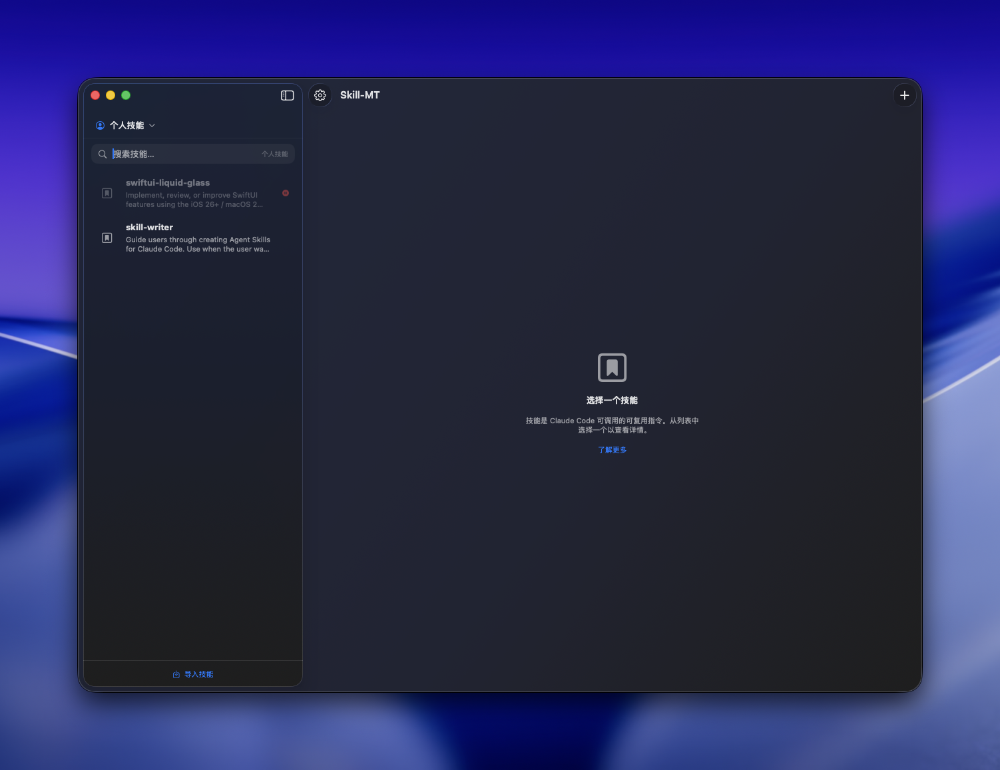
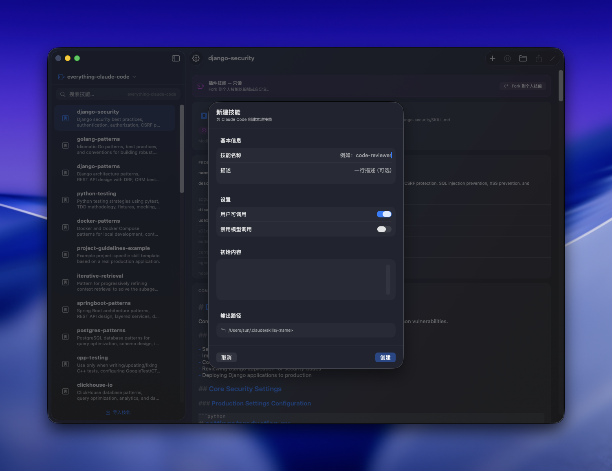
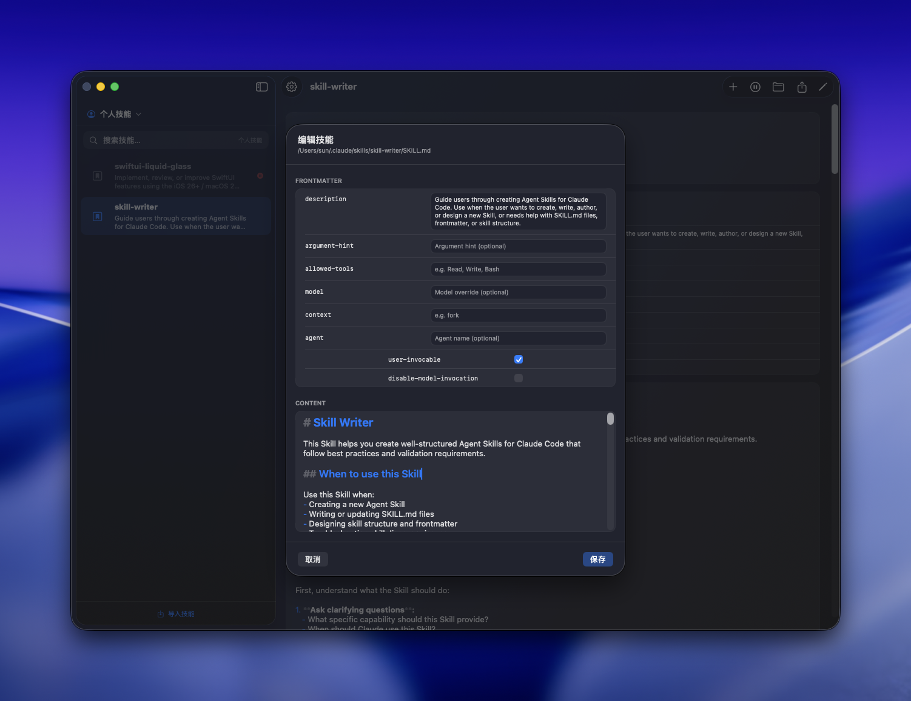
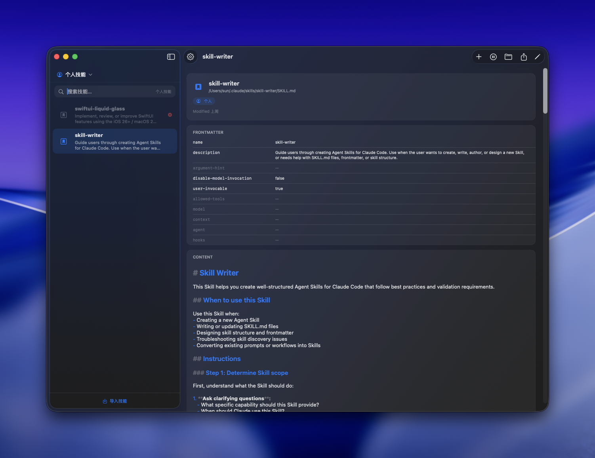
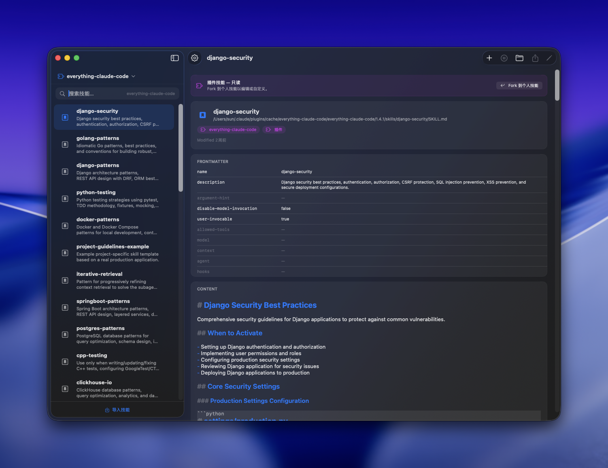

# Skill-MT


**Skill-MT** is a macOS GUI tool for managing Claude Code / Codex Skills.

If you use Claude Code, the Skills feature lets you save common AI instructions as files and invoke them anytime. But managing those files has always required manual folder operations. Skill-MT provides a clean GUI so you can manage all your skills without touching the command line.


[中文](README.md) | **English**

## Download

[**Download Latest Release →**](https://github.com/sunyifeng11111/Skill-MT/releases/latest)
Current stable version: `v1.2.3` (2026-02-27)

## Features

- **Create / Edit / Delete** skills with frontmatter and Markdown content editing
- **Enable / Disable** skills (via file renaming — no data is lost)
- **Import** skill folders or ZIP archives, **export** to share with others
- Manage Claude **personal skills**, **project skills**, **legacy commands**, and **plugin skills**
- Manage Codex **personal skills** and **system skills** (system skills are read-only)
- Real-time **search** by skill name and description
- Supports **Chinese / English** UI

## Installation

1. [Download Skill-MT-arm64.dmg](https://github.com/sunyifeng11111/Skill-MT/releases/latest)
2. Open the DMG and drag Skill-MT into your Applications folder
3. On first launch, macOS may warn "cannot verify developer" — **right-click the app → Open → Open**

## Build from Source

Requires Xcode 16+ and macOS 26+.

```bash
git clone https://github.com/sunyifeng11111/Skill-MT.git
cd Skill-MT/Skill-MT
open Skill-MT.xcodeproj
```

Press `⌘R` in Xcode to run.

## What are Skills?

Skills are Markdown files with YAML frontmatter used as reusable agent instructions:
- Claude: `~/.claude/skills/`
- Codex: `~/.codex/skills/` (system skills live under `~/.codex/skills/.system/`)

## Screenshots

**Main View**


**Create Skill**


**Edit Skill**


**Global Skills**


**Plugin Skills**


## License

MIT
